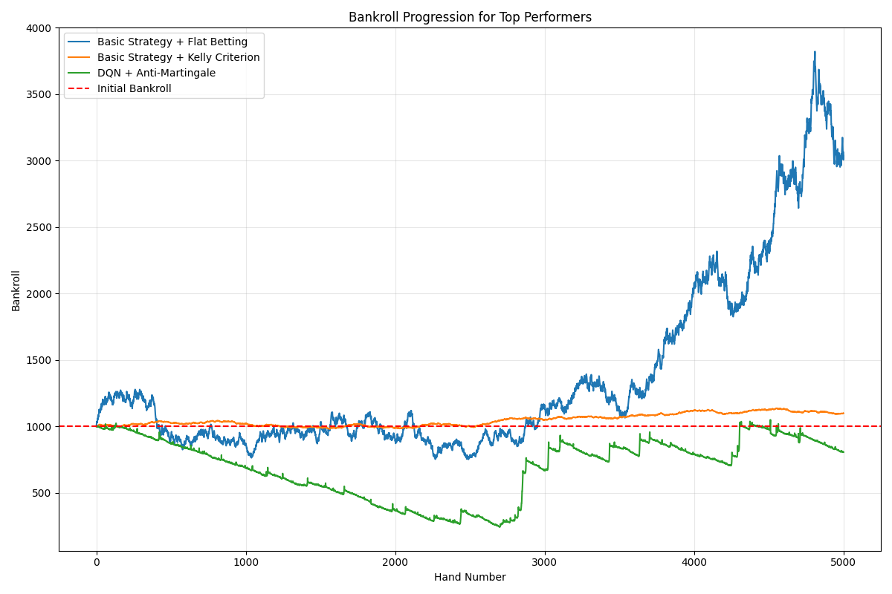

# Blackjack AI Model Comparison: Executive Summary

## Project Overview

This project explored the effectiveness of various reinforcement learning models combined with different betting strategies in a blackjack environment. We compared Deep Q-Network (DQN), Monte Carlo, Policy Gradient, and traditional Basic Strategy approaches across seven betting strategies to determine optimal combinations for maximizing returns and bankroll stability.

## Key Findings

### Best Overall Combinations

1. **Basic Strategy + Flat Betting**
   - 204% ROI ($2,036 profit)
   - 43% win rate
   - Completed all 5,000 hands with stable bankroll growth

2. **Basic Strategy + Kelly Criterion**
   - 10% ROI ($99 profit)
   - 43% win rate
   - Balanced risk-reward profile

3. **DQN + Anti-Martingale**
   - -19% ROI ($-194 loss)
   - 41% win rate
   - Best AI approach, maintaining 80.6% of initial bankroll

### Model Performance

| Model | Average Win Rate | Avg. Survival (hands) | Best Betting Strategy |
|-------|-----------------|----------------------|----------------------|
| Basic Strategy | 43% | 5,000 | Flat Betting |
| DQN | 41% | 4,719 | Anti-Martingale |
| Monte Carlo | 27% | 1,214 | Kelly Criterion |
| Policy Gradient | 23% | 962 | Kelly Criterion |

### Betting Strategy Effectiveness

| Strategy | Average ROI | Risk Level | Best With |
|----------|------------|------------|-----------|
| Flat Betting | +31% | Low | Basic Strategy |
| Kelly Criterion | -18% | Medium | Basic Strategy |
| Anti-Martingale | -47% | Medium-High | DQN |
| Oscar's Grind | -63% | Medium | DQN |
| Proportional to Count | -63% | Medium | Basic Strategy |
| Martingale | -141% | Very High | DQN |
| Fibonacci Progression | -200% | Extreme | None (all failed) |

## Critical Insights

1. **Traditional beats AI (for now)**
   - Basic Strategy consistently outperformed all reinforcement learning approaches
   - The 2% win rate difference between Basic Strategy and DQN (43% vs 41%) resulted in significant ROI differences

2. **Betting strategy impacts exceed model differences**
   - The choice of betting strategy had more impact on overall performance than the choice of playing strategy
   - Conservative betting strategies generally outperformed aggressive ones regardless of model quality

3. **DQN shows most promise among AI approaches**
   - Completed the full 5,000 hands with most betting strategies
   - Relatively stable performance across different betting approaches
   - Closest AI model to Basic Strategy performance

4. **Risky betting strategies consistently fail**
   - High-risk strategies like Fibonacci and Martingale depleted bankrolls regardless of the playing strategy quality
   - Sound money management proves critical even with strong playing strategies

## Recommendations

1. **For Optimal Results:** Use Basic Strategy with Flat Betting
2. **For Best AI Approach:** Use DQN with either Anti-Martingale or Kelly Criterion
3. **For Future Development:** Focus on:
   - Improving DQN architecture and training to close the win rate gap
   - Developing hybrid approaches combining Basic Strategy with RL
   - Designing adaptive betting strategies based on model confidence
   - Exploring ensemble methods that combine multiple model strengths

## Limitations

- Results based on specific blackjack rule set and parameters
- Models may require additional training or optimization
- Starting bankroll size affects relative performance of betting strategies
- Real-world casino conditions may introduce additional variables

For detailed analysis and complete results, please refer to the accompanying [Analysis_Results.md](Analysis_Results.md) and [Visualization_Guide.md](Visualization_Guide.md) documents. 