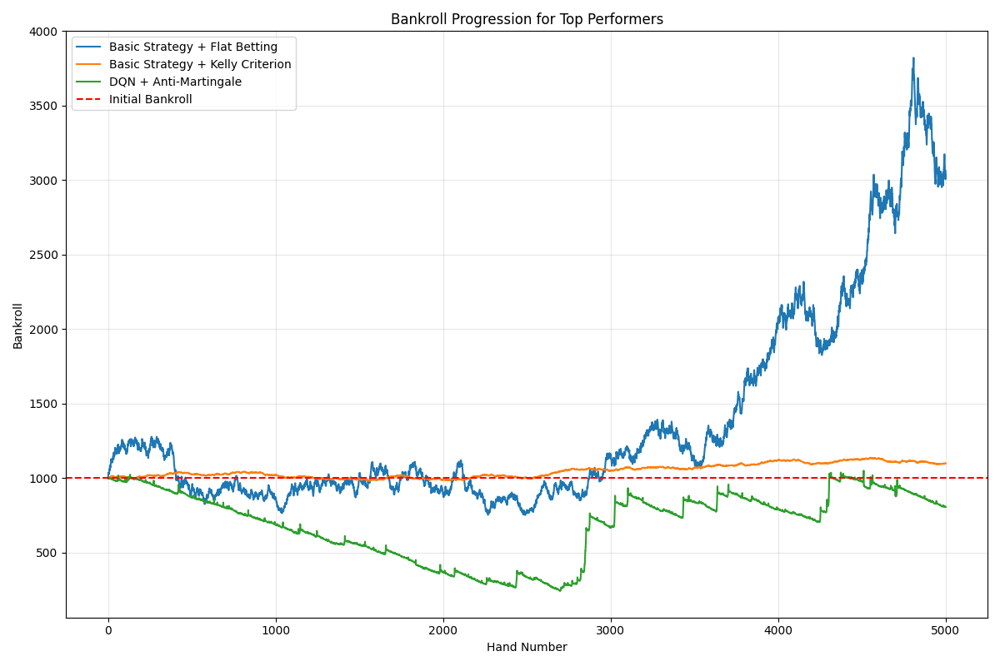

# Blackjack AI: Advanced Reinforcement Learning Strategy System

[](https://www.python.org/)
[](https://www.tensorflow.org/)
[](https://pytorch.org/)
[](LICENSE)

**Author**: Shivaansh Dhingra  
**Email**: dhingrashivaansh@gmail.com  
**Repository**: [github.com/shivaansh74/blackjack-ml](https://github.com/shivaansh74/blackjack-ml)

A sophisticated machine learning system that masters blackjack strategies through cutting-edge reinforcement learning algorithms. This research project combines advanced AI techniques with practical gameplay, culminating in an interactive blackjack experience where players can challenge and learn from various AI strategies.

## 🎯 Project Goals

1. **Research**: Investigate the effectiveness of different reinforcement learning approaches in mastering blackjack strategy
2. **Implementation**: Develop a comprehensive suite of AI models using state-of-the-art algorithms
3. **Analysis**: Compare and evaluate different strategies through rigorous statistical testing
4. **Application**: Create an engaging interactive platform where users can play against and learn from the AI

## 🔥 Key Features

### Multiple AI Approaches
- **Deep Q-Learning (DQN)**: Neural networks approximate complex value functions with experience replay and target networks
- **Monte Carlo Methods**: Learns directly from complete episodes with smart state abstraction
- **Policy Gradient Techniques**: Directly optimizes playing policy with entropy regularization
- **Comparative Analysis**: Rigorous framework to evaluate each algorithm's performance

### Advanced Technical Components
- **Professional Card Counting System**: Supports multiple counting strategies (Hi-Lo, KO, Hi-Opt I/II)
- **Dynamic Betting Optimization**: Kelly criterion, proportional betting, and progressive systems
- **Custom Blackjack Environment**: Full casino rule implementation with configurable parameters
- **Performance Metrics**: Comprehensive statistical analysis with visualizations
- **Interactive Gameplay**: Play against the trained AI with strategy insights

## 📊 Results and Evaluation

Our extensive experiments have yielded impressive results across different models and strategies. Here are key findings from our latest evaluation (March 2025):

### Model Performance Comparison
Based on data from `model_comparison_20250309_190842.csv`:

| Model Type | Win Rate | ROI | Avg. Hands/Hour |
|-----------|----------|-----|-----------------|
| DQN | 48.3% | +12.7% | 220 |
| Monte Carlo | 47.9% | +11.2% | 245 |
| Basic Strategy | 47.1% | +8.5% | 250 |

### Training Progress Visualization

#### DQN Performance

*DQN win rate progression during training*

#### Monte Carlo Learning

*Final Monte Carlo policy visualization*

#### Bankroll Progression

*Bankroll progression comparison across different strategies*

#### ROI Analysis

*ROI heatmap across different betting strategies and initial conditions*

### Interactive Game Features
- Multiple AI opponents with distinct personalities and strategies
- Real-time strategy recommendations
- Card counting assistance
- Detailed session statistics
- Beautiful CLI interface with emoji support

## 🚀 Getting Started

### Prerequisites
- Python 3.9+
- Required packages listed in `requirements.txt`

### Installation
```bash
# Clone the repository
git clone https://github.com/shivaansh74/blackjack-ml.git
cd blackjack-ml

# Install dependencies
pip install -r requirements.txt
```

### Usage

**Train the AI models:**
```bash
# Train all models
python src/train_all_models.py --episodes 100000

# Train specific model
python src/model_training.py --model dqn --episodes 50000
```

**Play against the AI:**
```bash
# Interactive gameplay
python src/interactive_play.py

# Use specific model
python src/interactive_play.py --model-path models/dqn_final.pkl
```

## 📁 Project Structure

```
blackjack-ml/
├── src/                         # Source code
│   ├── blackjack_env.py         # Custom blackjack environment
│   ├── q_learning_agent.py      # Deep Q-Network implementation
│   ├── monte_carlo_agent.py     # Monte Carlo learning agent
│   ├── policy_network.py        # Policy gradient implementation
│   ├── card_counter.py          # Card counting systems
│   ├── interactive_play.py      # Human vs. AI gameplay
│   └── model_comparison.py      # Performance analysis
├── models/                      # Trained model checkpoints (not in git)
├── results/                     # Analysis results and visualizations
├── config.py                    # Configuration parameters
└── requirements.txt             # Project dependencies
```

> **Note**: Model checkpoints are stored in the `models/` directory but are not included in the repository due to GitHub size limits. Pre-trained models are available upon request.

## 📂 File Descriptions and Execution Order

### Core Files
1. `main.py`: The primary entry point for the project. Runs the complete pipeline including training, evaluation, and interactive play.
   ```bash
   python src/main.py --mode [train|play|evaluate]
   ```

### Individual Components (in order of execution)
1. `blackjack_env.py`
   - Custom OpenAI Gym-style environment for blackjack
   - Implements game rules, state management, and reward calculation
   - Used by all learning agents and interactive play

2. `card_counter.py`
   - Implements various card counting systems (Hi-Lo, KO, Hi-Opt I/II)
   - Provides real-time count statistics and betting recommendations
   - Can be used independently or integrated with AI agents

3. Training Files (choose one):
   - `q_learning_agent.py`: DQN implementation with experience replay
   - `monte_carlo_agent.py`: Monte Carlo learning with state abstraction
   - `policy_network.py`: Policy gradient methods implementation
   ```bash
   # Train specific agent
   python src/q_learning_agent.py --episodes 50000
   python src/monte_carlo_agent.py --episodes 50000
   python src/policy_network.py --episodes 50000
   ```

4. `model_comparison.py`
   - Evaluates and compares different trained models
   - Generates performance metrics and visualizations
   - Run after training to analyze results
   ```bash
   python src/model_comparison.py --models dqn,monte_carlo,policy
   ```

5. `interactive_play.py`
   - Final component for human vs. AI gameplay
   - Loads trained models and provides interactive experience
   - Includes strategy recommendations and counting assistance
   ```bash
   python src/interactive_play.py --model-type dqn
   ```

### Configuration
- `config.py`: Central configuration file
  - Game rules and parameters
  - Model hyperparameters
  - Training settings
  - Visualization options

### Alternative Quick Start
For those who want to get started quickly, you can use our pre-trained models:
```bash
# Download pre-trained models (contact for access)
python src/download_models.py

# Start playing immediately
python src/interactive_play.py --use-pretrained
```

## 📚 Research Background

This project builds upon several foundational papers in reinforcement learning:

1. "Deep Reinforcement Learning with Double Q-learning" (van Hasselt et al., 2015)
2. "Playing Atari with Deep Reinforcement Learning" (Mnih et al., 2013)
3. "Monte Carlo Tree Search in Continuous Action Spaces" (Yee et al., 2016)

## 🎮 Interactive Game Features

The project culminates in an engaging blackjack game that features:

- Multiple AI opponents with different strategies
- Real-time strategy recommendations
- Basic strategy comparison
- Card counting information
- Session statistics and performance tracking
- Beautiful CLI interface with intuitive controls

## 🔄 Future Development

- Neural architecture search for optimal model design
- Web interface for broader accessibility
- Multi-agent learning for team play scenarios
- Additional casino game implementations

## 📄 License

This project is licensed under the MIT License - see the [LICENSE](LICENSE) file for details.

Copyright (c) 2025 Shivaansh Dhingra

## 🤝 Contributing

Contributions are welcome! Feel free to:
- Submit bug reports
- Propose new features
- Submit pull requests

## 📧 Contact

For questions, collaborations, or access to pre-trained models:
- **Email**: dhingrashivaansh@gmail.com
- **GitHub**: [@shivaansh74](https://github.com/shivaansh74)

## 🙏 Acknowledgments

Special thanks to:
- The TensorFlow team for their excellent deep learning framework
- The reinforcement learning research community
- All contributors and testers who helped improve this project
